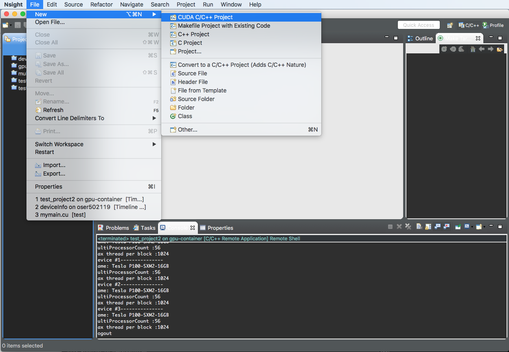
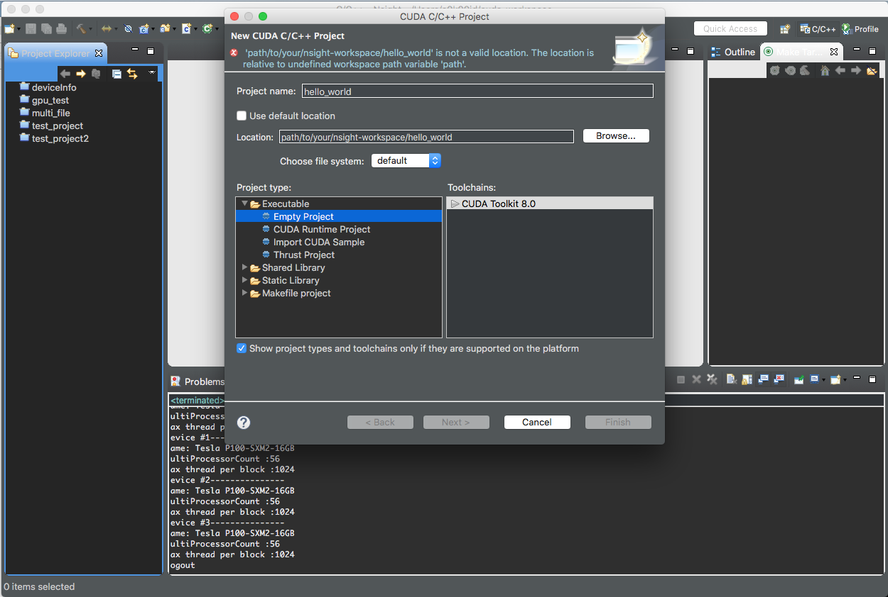
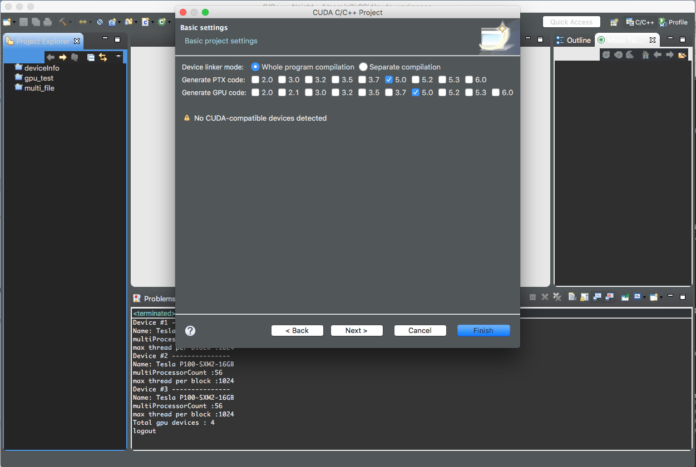
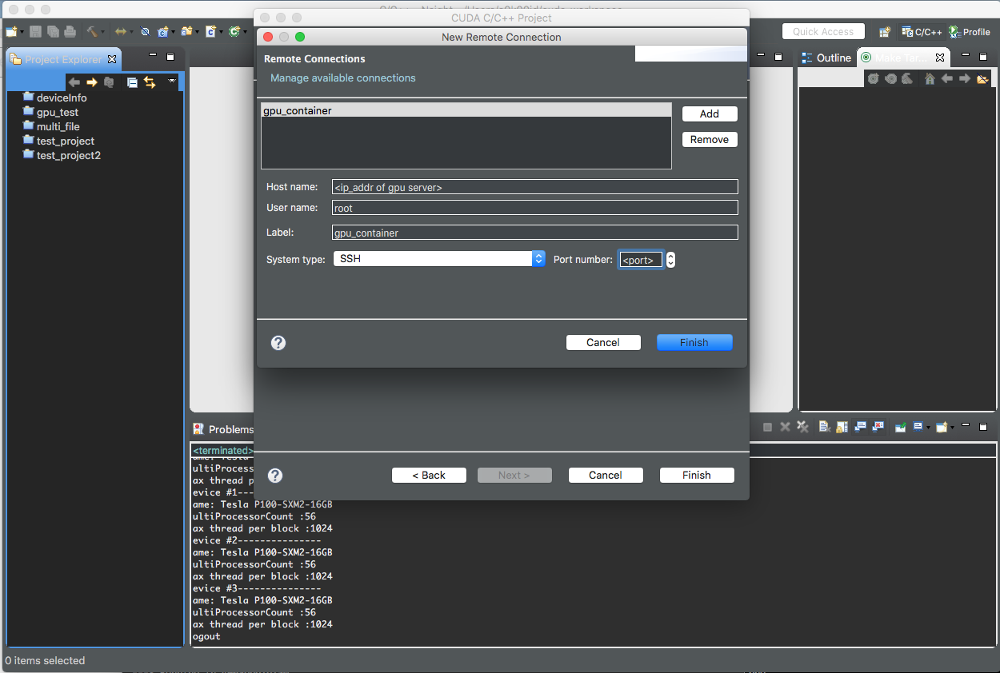
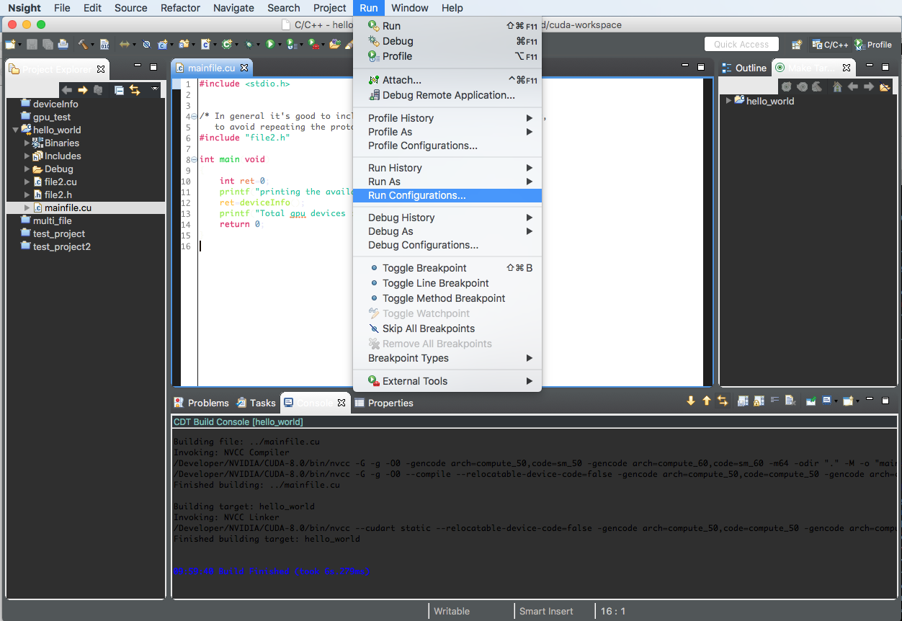
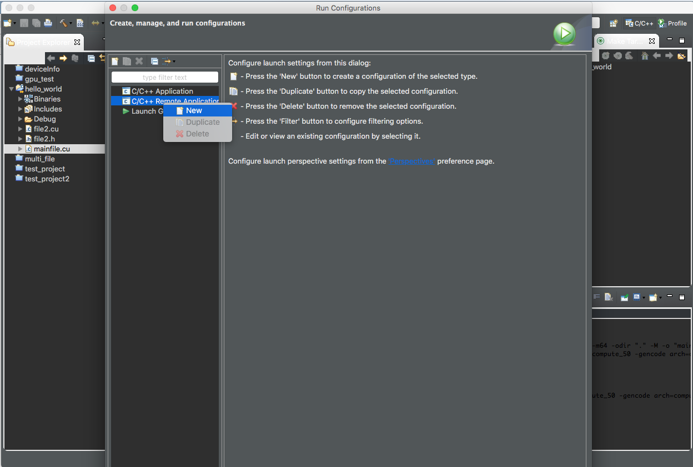
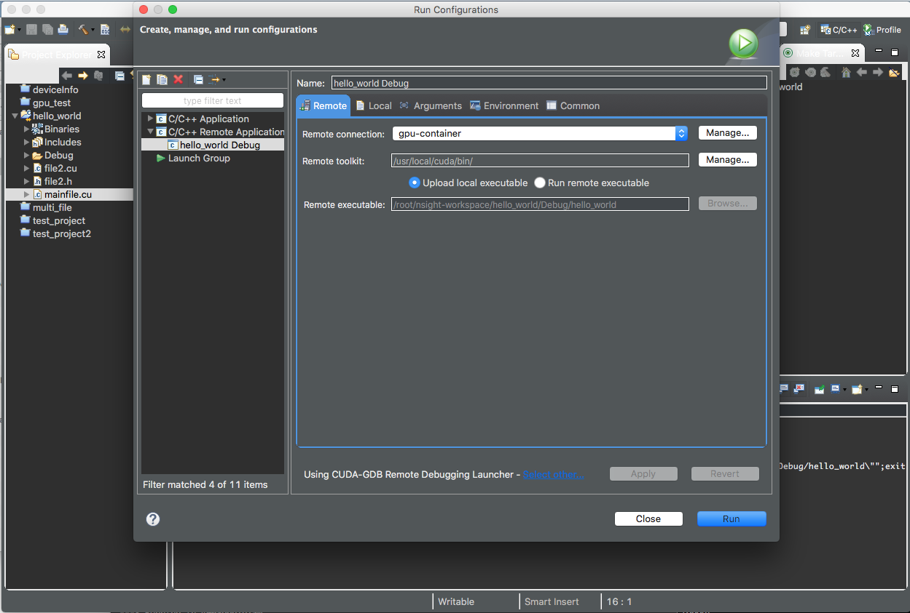
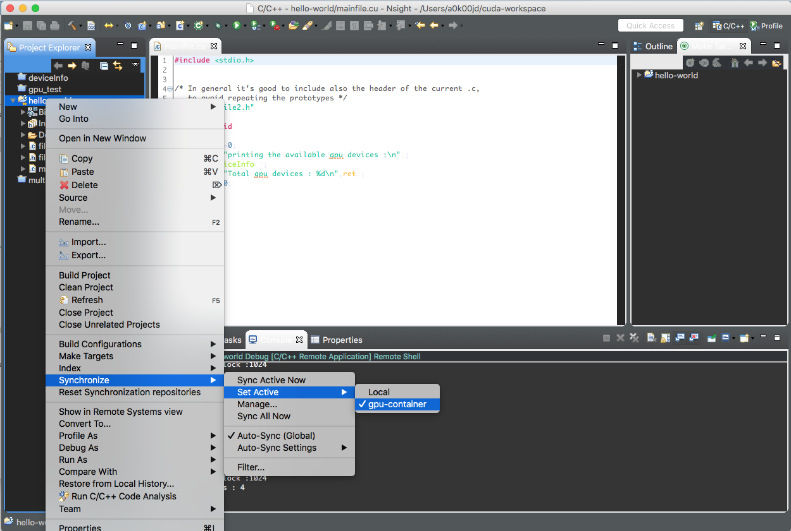
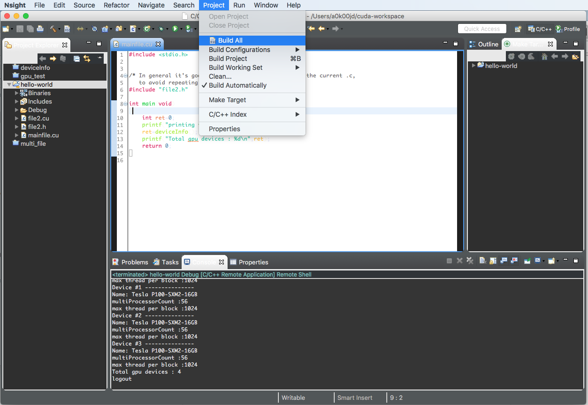

# Nsight: run CUDA code on  remote gpu server
*nsight, an eclipse IDE for CUDA programming*

### Steps for configuring the execution on remote gpu server:  

---

#### Insallation:

1. nvidia cuda-toolkit can be installed from [here](https://developer.nvidia.com/cuda-downloads). Not necessary to have GPU device on local.  
2. set the system path for nvcc compiler.  
3. run `nvcc -V` on you local machine to get the version.
4. run the `nsight` on you local, it will open the nsight ide in GUI.
5. ssh into remote the server and pull the docker image on remote server using: `docker pull kayush206/ssh-docker`  
6. run the docker image on remote server using: `nvidia-docker run -d -p <port>:22 kayush206/ssh-docker`. replace the `<port>` with the available port of remote(i.e `54321`). 
   

#### Configuration:

1. Create a `CUDA C/C++ Project`:  

2. Choose the project location on local as default and project type as `Empty Project` and click on `Next`.  

2. Under the `Basic settings`, tick the `Generate PTX code` and `Generate GPU code` as `5.0` boxes and **untick the `2.0` boxes** (not supported with cuda-9.0) and click on `Next`.  

3. Under `Target Systems`,click on `manage` and then click on `add` to add the remote connect details. replace the: 
	* `<ip_addr of gpu server>` by gpu host address,  
	* `<port>` by port to which container is mapped(i.e. `54321`),  
	* set `User name` to `root`,  
	* set `Label` to `gpu-container` 
	  
	and click on `Finish`.  
	

4. Under `Target Systems`, Add the project location and Toolkit details for remote(`gpu-container`) And selcet the `x86_64` as CPU Architecture in `Local System` and `gpu-container`. 
  

5. Copy all the `*.cu` and `*.h` files from the `src` to project.

6. Click on the `Run Configuration` from `Run` for configuring project in order to execute it on remote gpu server.

7. Right click on `C/C++ Remote Application` and choose `New`:

8. Click on the `Remote` tab and in `Remote Connection` choose `gpu-container`. And verify that `Remote toolkit` is exactly same as `/usr/local/cuda/bin`.  
Edit the `Remote executable` by clicking `Run remote executable` to **`/root/nsight-workspace/hello_project/Debug/hello_project`** after done with editing, click back to `Upload local executable`.   

9. In order to synchronize your project files between local and remote, select the `Set Active` to `gpu-container`.  
And then, whenever you want to manually sync projecct files, click on `Sync Active Now`.

10. In order to build the project, choose `Clean...` and then `Build All` from `Project` tab.
 

11. click on the run button (green circle). if everything goes fine you will be able to see the output as details for you gpu devices.

#### References:

1. [Executing CUDA C++ Application on a remote machine using Nsight Eclipse](https://medium.com/@rajeshkumar/executing-cuda-c-application-on-a-remote-machine-using-nsight-eclipse-fb8364029625)

